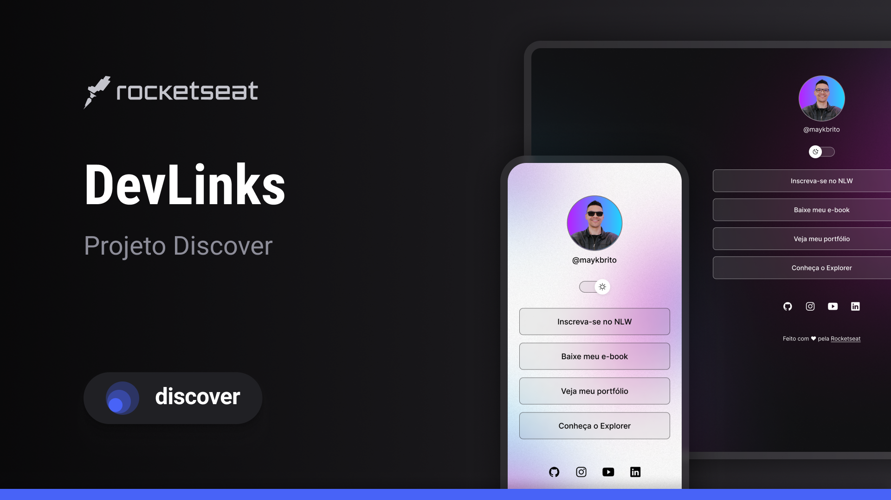

<h1 style="text-align: center"> Devlinks </h1>

    Projeto promovido pela Rocketseat para ensino de tecnologias WEB.

    

## 🚀 Tecnologias

Esse projeto foi desenvolvido com as seguintes tecnologoias:

- HTML e CSS
- Javascript
- Git e Github

## 💻 Projeto

O Devlinks é um agregador de links para usar como cartão de visitas online.

## 🔖 Layout

Você pode visualizar o layout do projeto através [DESSE LINK](https://www.figma.com/file/EiovJ6S3IGpJ036mQHgJTm/DevLinks-%E2%80%A2-Projeto-Discover-(Community)?node-id=1437%3A191&mode=dev). É necessário ter conta no [Figma](https://figma.com) para acessá-lo.

## 📝  Licença

Esse projeto está sob a licença MIT.

---

